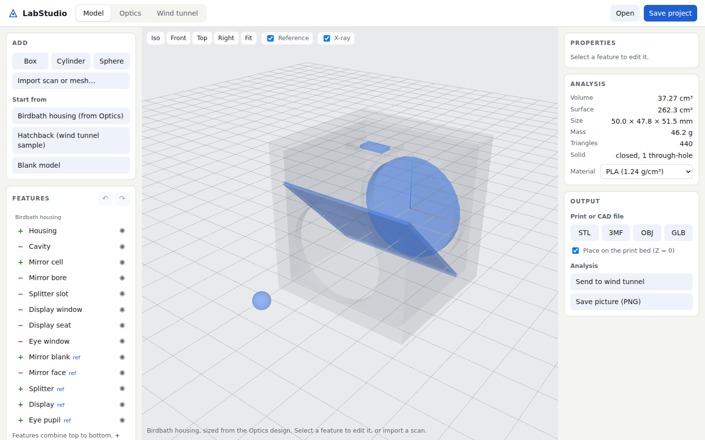

# LabStudio

Scan it, model it, then print it or test it, all in the browser.

LabStudio is one web codebase for engineering work: a CAD workspace, optics ray tracing, and a GPU wind tunnel that share the same geometry, units and files. Everything runs locally in your browser. Heavy jobs (OpenFOAM, photo-to-3D) can optionally go to your own AWS account.



## Run it

Requires Node.js 22 or newer. Nothing to install.

```sh
npm run dev      # then open http://localhost:5173
npm test         # CAD core + optics physics (30 tests)
npm run build    # static site in _site/
```

The wind tunnel needs WebGPU (current Chrome or Edge, Safari 26). The Model and Optics workspaces need WebGL 2.

## Workspaces

| Tab | What it does | Default |
|---|---|---|
| **Model** | Parametric CAD on the [Manifold](https://github.com/elalish/manifold) kernel: boxes, cylinders, cones, spheres and imported meshes combined with add, cut and intersect; position and rotation; undo; reference bodies; volume, area and mass; STL, 3MF, OBJ and GLB export; send to the wind tunnel | A printable **birdbath housing** sized from the current optics design |
| **Optics** | Mirrorlab: exact 3D ray tracing through a birdbath (display, splitter, curved mirror, eye), pupil and eyebox analysis, parameter sweeps | The **birdbath** display |
| **Wind tunnel** | Splat Tunnel: a D3Q19 lattice-Boltzmann wind tunnel in WebGPU with live drag and lift, smoke and a speed slice | The **hatchback** sample, ready to run |

### The pipeline

```
scan (.ply splats, .stl, .obj, .glb, point cloud)
   │  Import: units, up axis, scale; closed meshes kept exactly, anything else rebuilt as a solid
   ▼
Model (CAD) ──► Print: STL / 3MF placed on the bed, mass for your material
   │   ▲
   │   └── Optics: "Birdbath housing (from Optics)" rebuilds the housing around the current design
   ▼
Wind tunnel: "Send to wind tunnel" drops the part in and builds the solid
```

## Repository layout

```
apps/studio/          the studio shell and Model (CAD) workspace
  web/src/cad.js        feature list → solids (Manifold), analysis, project files
  web/src/templates.js  birdbath housing from optics parameters, hatchback sample
  web/src/scan.js       scan or mesh → closed solid in mm, Z up
  tests/                CAD tests (node --test) and a browser smoke test
apps/mirrorlab/       optics ray tracer (own README, docs/, physics tests)
apps/splattunnel/     wind tunnel and scan-to-CAD, optional AWS backend in aws/
packages/geometry/    shared loaders, voxel tools, mesher, exporters, sample shapes
packages/vendor/      Manifold geometry kernel (WASM)
scripts/              dev server and site build
.github/workflows/    ci, pages, browser (manual), splattunnel-aws (inert until configured)
ROADMAP.md            where things stand and what to build next
```

## Publish on GitHub Pages

Settings → Pages → Source: **GitHub Actions**, then run the **pages** workflow from the Actions tab. To redeploy on every push to `main`, add the repository variable `ENABLE_GITHUB_PAGES = true`.

## License

Copyright © 2026 Alexander Sweet. LabStudio is free software under the GNU General Public License, version 3 or (at your option) any later version. See [LICENSE](LICENSE).

Bundled third-party code keeps its own license, all compatible with GPL-3.0: Three.js (MIT, `apps/mirrorlab/web/vendor/three/LICENSE`) and Manifold (Apache-2.0, `packages/vendor/manifold/LICENSE`).
