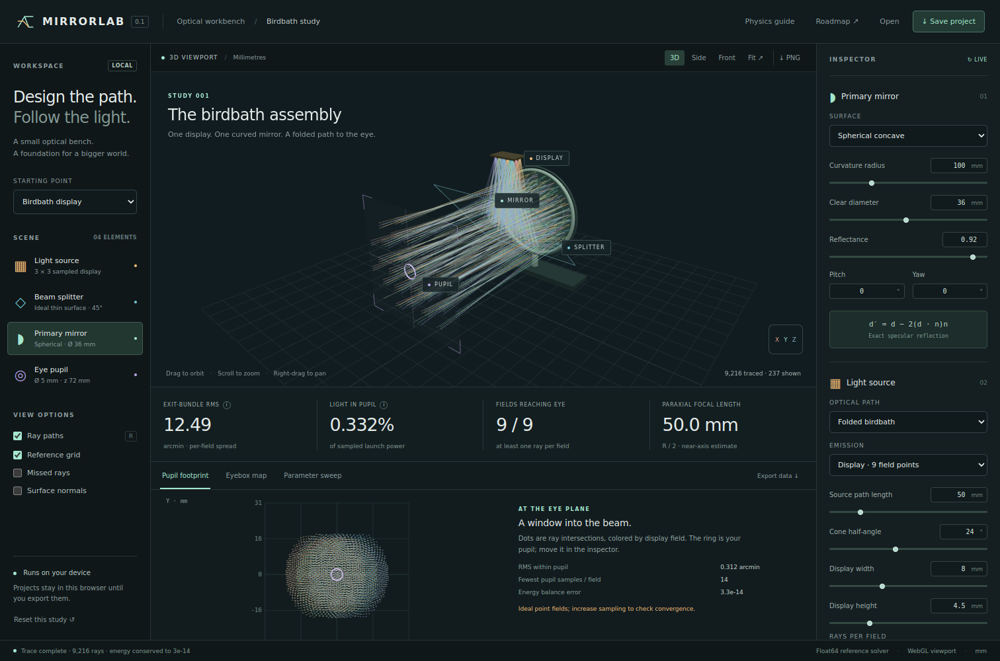

# Mirrorlab

**A browser workbench for mirror optics, with a plan to grow into a world-scale engineering modeler.**

Start with one optical channel. Change a surface, trace the actual 3D rays, examine the pupil, and compare candidate geometries.



## Run it

Requires Node.js 22 or newer. The application and physics tests need **no npm install**.

```sh
npm run dev
```

Open **http://localhost:5173**. Alternatively, `python3 -m http.server 8000 --directory web` serves the same static app. Use an HTTP server; opening `index.html` as a local file does not support the module worker.

```sh
npm test            # deterministic physics and project-format checks
npm run benchmark  # sampling convergence and measured runtime on your machine
npm run build      # self-contained static files in dist/
```

WebGL 2 is required for the viewport. Numerical tracing runs in a Web Worker with JavaScript Float64 arithmetic. Three.js is vendored with its license; there are no runtime CDNs, accounts, or cloud jobs. Local storage remembers the current parameter set; JSON export makes it portable.

## Included in v0.1

| Capability | What is implemented |
|---|---|
| 3D editing | Orbit, pan, zoom, preset camera views; parameter controls; mirror pitch and yaw |
| Surfaces | Exact plane, spherical-cap, and paraboloid intersections; finite circular mirror apertures |
| Sources | On-axis point, nine equal-power display field points, or a uniform-area parallel beam |
| Birdbath path | Ideal 45° splitter → curved mirror → splitter transmission → pupil |
| Physics | Specular reflection, scalar reflectance, aperture clipping, full power accounting |
| Analysis | Per-field angular spread, pupil-collected power, pupil footprint, sampled eyebox map |
| Exploration | 13 × 13 curvature/path sweep, numerical ranking, apply best sampled candidate |
| Portability | Validated project JSON import/export, field/sweep CSV, viewport PNG |
| Repository | Tests, Pages workflow, four example projects, engineering roadmap, architecture, backlog |

**This is a geometrical-optics prototype.** It does not yet implement lens refraction, diffraction, polarization, measured coating curves, ghost paths, finite emitting pixels, CAD solid modeling, arbitrary multi-mirror scenes, or a planetary renderer. Those are explicit later milestones, not hidden behind current controls.

## Try these studies

1. **Parabolic collimator:** select the preset. At source distance 50 mm and curvature parameter 100 mm, the on-axis exit rays become parallel to numerical precision. Change distance to 60 mm and inspect the increased angular spread.
2. **Spherical focus:** parallel incident rays focus near 50 mm, while marginal rays cross earlier. This is spherical aberration, calculated from the surface rather than added visually.
3. **Birdbath display:** inspect nine field bundles, move the pupil, then compare the exit-bundle RMS with the RMS seen through that pupil. They answer different questions.
4. **Parameter sweep:** keep a curved mirror and point/display source selected. Run the grid, inspect a cell, and apply the best candidate. Increase rays per field before trusting a small improvement.

For the initial birdbath preset, the 4,096-rays-per-field check gives approximately **12.517 arcmin exit RMS** and **0.33255% of sampled launch power in the centered 5 mm pupil**. The denominator is the selected 24° half-angle source cone, not a real display's total light output. No real panel prescription is implied.

## Read next

- [Project plan: mirror bench → engineering CAD → world-scale modeler](PROJECT_PLAN.md)
- [Physics, units, metrics, and assumptions](docs/PHYSICS.md)
- [Architecture and future module contracts](docs/ARCHITECTURE.md)
- [Validation results and reproducible checks](docs/VALIDATION.md)
- [Prioritized engineering backlog](docs/BACKLOG.md)
- [Publish the browser app on GitHub Pages](docs/GITHUB.md)
- [Splat Tunnel integration plan](docs/SPLATTUNNEL.md)
- [Sources and vendored dependencies](docs/SOURCES.md)

## Repository map

| Path | Purpose |
|---|---|
| `web/src/physics.js` | Rendering-independent reference kernel, validation, project format |
| `web/src/worker.js` | Numerical trace and sweep jobs |
| `web/src/view.js` | Three.js viewport; sampled meshes for display only |
| `web/src/plots.js` | Footprint, eyebox, and sweep plots |
| `web/src/app.js` | Parameter editing, results, project import/export |
| `web/vendor/three/` | Pinned local Three.js modules and MIT license |
| `tests/` | Physics, invariants, round trips, and optional browser checks |
| `examples/` | Four portable project JSON files |
| `docs/` | Plans, physics specification, validation, sources |

## License

Copyright © 2026 Alexander Sweet. GNU General Public License v3.0 or later; see [`LICENSE`](../../LICENSE) at the repository root. The vendored Three.js keeps its own MIT notice in `web/vendor/three/LICENSE`.
