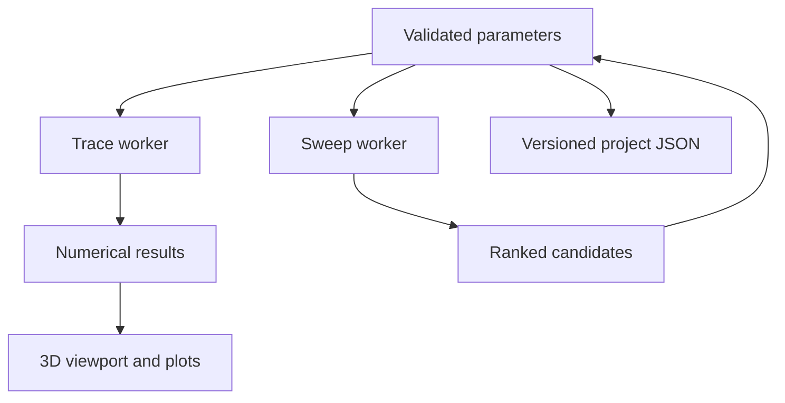
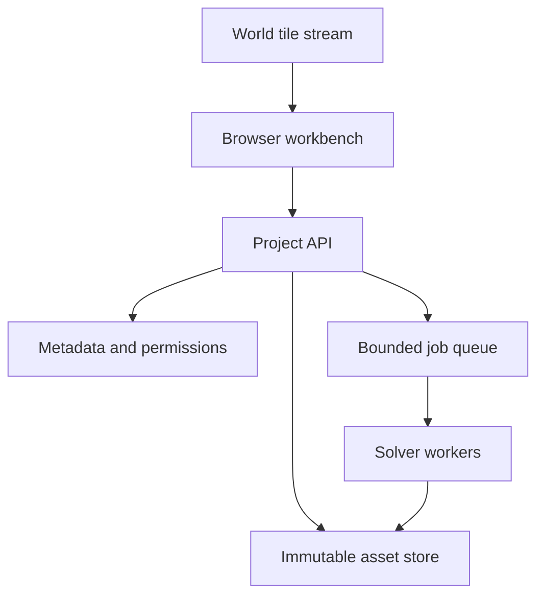

# Architecture and expansion boundaries

## Current executable system

The v0.1 application is static ES modules. There is no backend, build framework, remote solver, dependency installation at runtime, or account system. A Worker owns the numerical work; the UI owns a validated parameter snapshot. A second, disposable Worker owns each grid sweep, so editing can cancel a sweep without freezing the viewport.



The optical surface functions in `physics.js` are authoritative. `view.js` samples those same equations to draw a mesh. Changing mesh ring counts cannot change the numerical ray path. Renderer coordinates are also mm in v0.1; there is no geospatial transform yet.

Worker messages include a request ID. Superseded trace results do not update the current display. Sweep workers are terminated when inputs change or the user cancels. Results are not cached across app reloads. The current parameters alone are stored in `localStorage`; exports are ordinary files.

The source tree is intentionally small. There is no unused CAD dependency or empty plugin framework posing as an implementation. The functions below describe boundaries to evolve, not APIs already shipped.

## Future authoritative scene document

Introduce `ProjectSnapshot`, then derive solver scenes and display scenes from it. A proposed record is:

```ts
type ProjectSnapshot = {
  schemaVersion: number;
  snapshotHash: string;
  parentSnapshotHashes: string[];
  unitSystem: { length: 'm'; angle: 'rad'; temperature: 'K' };
  frames: ReferenceFrame[];
  objects: SceneObject[];
  parameters: ParameterGraph;
  studies: StudyDefinition[];
  assetReferences: ContentAddressedAsset[];
};
```

This future SI schema must have an explicit migration from the current v1 **mm/degree** project format. Do not quietly reinterpret existing numbers as metres or radians.

Every object needs a stable ID, parent/frame ID, transform, semantic kind, exact source definition or source asset hash, material assignment, visibility, and separate solver participation flags. Visibility is not automatically physical transparency. Optical surfaces should have explicit sidedness and material/media on both sides. GPU buffers and thumbnails are derived caches.

Every derived asset records its source hash, generator version, transform/units, precision/tolerance, creation parameters, and uncertainty where applicable. Never replace a raw scan with a cleaned mesh under the same immutable content hash.

## CAD adapter

Proposed calls: create/update an exact solid from parameterized features; get stable object references; generate a display mesh at a stated chord tolerance; export STEP; derive solver boundary representations; report failures or invalid solids. Kernel operations run in a Worker or isolated server job. Undo/redo records commands and parameter changes, not unbounded copies of large meshes.

Replicad/OpenCascade.js is a candidate implementation, not a current dependency. Keep that choice behind the adapter. Analytic optical surfaces can remain exact functions even when their mounts are B-rep solids. A imported STL's triangle normals are not a substitute for a measured optical prescription.

## Solver adapter

```ts
type SolverRequest = {
  jobId: string;
  projectSnapshotHash: string;
  studyId: string;
  solver: { id: string; version: string; buildHash: string };
  geometryHashes: string[];
  settings: unknown; // versioned and solver-specific, validated before execution
  sampling: { method: string; seed?: number; count: number };
  limits: { timeSeconds: number; memoryBytes: number };
};
type SolverResult = {
  requestHash: string;
  status: 'converged' | 'finished' | 'cancelled' | 'failed';
  metrics: MetricWithUnitsAndDefinition[];
  convergence: ConvergenceEvidence;
  warnings: StructuredWarning[];
  artifacts: ContentAddressedAsset[];
};
```

“Finished” must not imply “converged.” Optical integration convergence, CFD residuals, structural residuals, and time-step accuracy have different definitions. The UI must display the solver's evidence instead of promoting a task-complete event into a physics claim. A ray sample count is not a steady-state residual.

Client/server implementations may share a request schema, but the numerical method and capability set must remain explicit. CPU Float64, WebGPU Float32, WASM, and a cloud reference solver may have different precision and support. Run the same analytic fixtures on each supported engine.

## Optimization and nodes

Keep independent design-variable and sampling grids. Design variables change geometry/materials; sampling axes test fields, wavelengths, pupils, conditions, and tolerances. An optimizer consumes both a study definition and explicit constraints.

Example future optical objective: minimize worst-field angular blur over specified eye positions, subject to minimum pupil throughput, target angular field, target vergence, maximum package volume, feasible manufacturing dimensions, and surface constraints. Avoid one opaque weighted score until users can inspect the component metrics and why a candidate is infeasible.

The node editor should manipulate a typed dependency graph: parameter → feature → assembly → study → result → objective. Use units on ports and detect cycles. A cycle is allowed only when deliberately modeled as a solver-controlled iterative coupling with a convergence condition. Keep the current controls as another view of the same model.

## Proposed service layout



The API validates membership and project access before issuing short-lived object grants or launching jobs. Solver workers receive scoped inputs, no user session cookie, and bounded resources. Results are immutable artifacts with lineage. Client cancellation and server cancellation are separate state transitions with idempotent handling.

Start with one region and one relational database unless actual workload measurements demand more. Asset streaming and job distribution are independent scaling problems. A world's visible tiles should not multiply the compute domain for every optical assembly.

## World-coordinate precision

Future geospatial placement should record a CRS, datum/epoch where relevant, vertical datum, local Cartesian origin, orientation, and unit conversion. For a geographic anchor, derive a local tangent basis with a documented axis convention. Store canonical placement in Float64. Send camera-relative positions or high/low split coordinates to the GPU. Run engineering solvers in local coordinates.

Approximate float32 spacing near 6.4 × 10⁶ m is 0.5 m. Directly uploading Earth-centered float32 positions therefore cannot preserve mm-scale assembly geometry. Origin rebasing fixes display precision; it does not make an arbitrary global CFD domain practical or replace a valid coordinate transformation.

## Asset formats and roles

| Representation | Intended role | Precision/authority |
|---|---|---|
| Current project JSON | Current optical parameters and schema | Authoritative for v0.1 |
| Future exact surface/B-rep | Design intent and manufacturing surfaces | Authoritative with tolerance and units |
| STEP | Solid/CAD interchange | Verify topology and unit round trips |
| glTF/GLB | Efficient visual meshes/materials | Derived for rendering unless sole source |
| 3D Tiles | Spatial hierarchy and streamed geospatial context | Context; preserve frame metadata |
| Raw scan / splats | Captured observations and appearance | Measurement with provenance/uncertainty |
| Solver mesh/field | Discretization and numerical outputs | Bound to a geometry revision and method |

Do not adopt every format in one release. Add a format when a concrete workflow needs it and a round-trip fixture can verify it.
